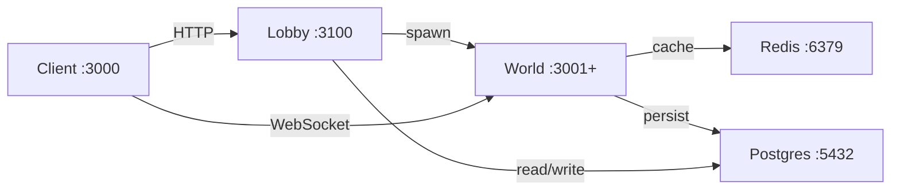
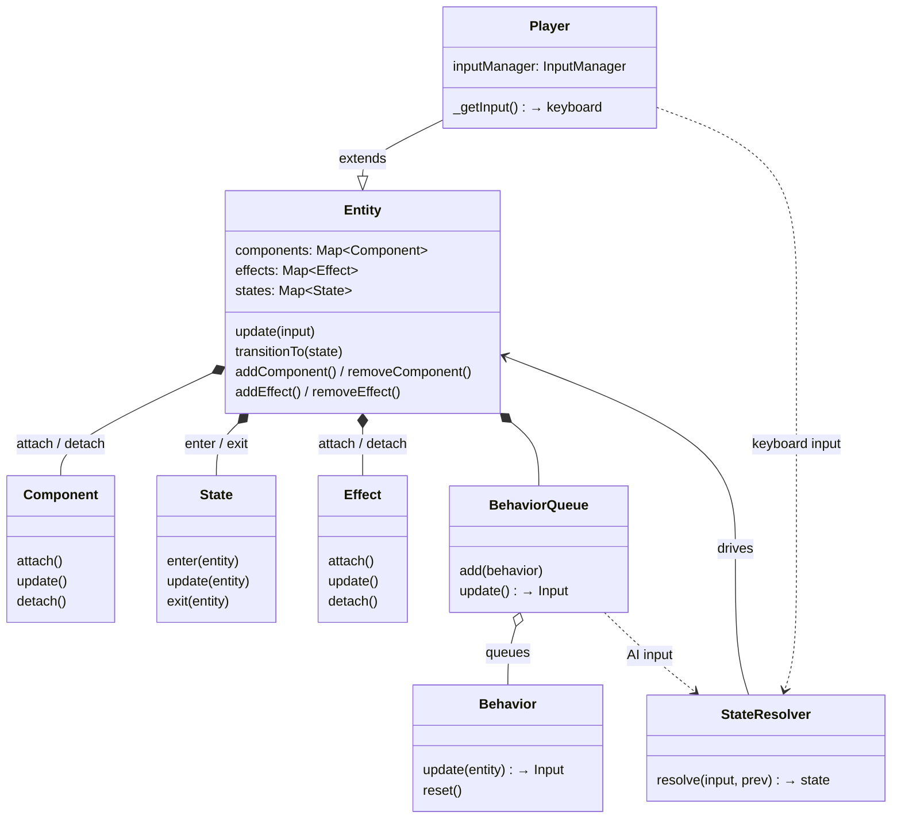
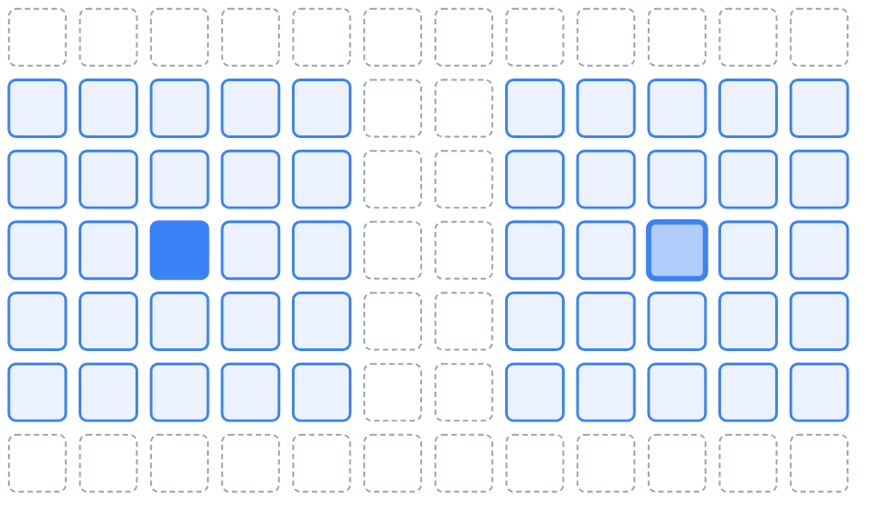

# Waken

Waken is a multiplayer cozy game with adventurous elements. Players tend to a small village and its needs, including farming crops, taming animals, and gathering resources.

The player possesses a rare gift: Sleepwander. They can traverse dimensions within dreams and materialize treasures from them. Their mission is to defeat a cunning entity that has long plagued the villagers' sleep. But they aren't the only ones who can walk the dream world. A dangerous cult seeks to empower the evil being further. And the dreamy realms they inhabit can be just as perilous as the creature they're hunting.


## Getting Started

### 1. Install dependencies

```bash
npm install
```

This installs dependencies for both client and server workspaces.

### 2. Run development servers

```bash
npm run dev
```

This runs both the server (port 3001) and client (port 3000) concurrently.

Alternatively, run them separately:

```bash
# Terminal 1 - Server
npm run dev:server

# Terminal 2 - Client
npm run dev:client
```

## Building for production

```bash
npm run build
```

## Server commands

```bash
npm run server:deploy    # Deploy to production
npm run server:connect   # SSH into server
npm run server:logs      # View logs
npm run server:status    # Check status
npm run server:restart   # Restart server
```

## Client target

```bash
npm run client:local     # Point to localhost
npm run client:remote    # Point to production
```

## Architecture

The client connects to a lobby server over HTTP which spawns and assigns world instances. Each world maintains its own WebSocket connection to connected clients, caches live state in Redis, and persists player data to Postgres.



Production: `178.104.59.213`

## System design

### Entity system

All entities share a single `Entity` class. What an entity *is* is defined by its components, what it's *doing* by its current state, and what's *happening to it* by its effects, all attachable and detachable at runtime. Every entity produces the same input structure each tick (players from the keyboard, AI from a behavior queue), which is resolved into state transitions. Players broadcast their input over the network; the update loop makes no distinction between local and remote. Entity definitions are plain config objects shared between client and server; an orc and a tree use the same structure, just different fields.



### Authority and chunks

Every client runs the full simulation, but only one decides what non-player entities do. The first player to join a world becomes the **host** and holds authority: their client generates AI input, resolves combat hits, and keeps the broad view of active chunks. Everyone else is an **observer**. They still render and physically simulate those entities, but they don't think for them. Instead they receive the host's entity input over the network and replay it, so an orc lunges at the same moment on every screen. If the host disconnects, authority transfers to another player automatically. Players are the exception: each client always drives its own player and broadcasts that input to the rest. Nobody has authority over your character but you.

The world is diced into fixed-size **chunks**, and each chunk is a socket room. A client joins the `chunk:key` room for every chunk within an activation radius of two of its player and leaves it when the player moves away, so entity events only reach the clients who can actually see them. The host additionally tracks the full set of active chunks across the world, which is how it drives entities that no single observer is close enough to receive. When a chunk goes unused, it deactivates and its **stale entities** are cleaned up on the clients that were subscribed, so observers don't keep simulating orcs in a region nobody occupies.



### Handlers

Handlers are stateless plain objects grouping pure functions by domain (`combat`, `move`, `state`, `player`, etc.). No classes, no instantiation, just `handlers.combat.resolve()`. Both client and server export a single `handlers` object; each handler operates on data passed in and calls sibling handlers as needed. This keeps game logic flat, composable, and free of hidden state.